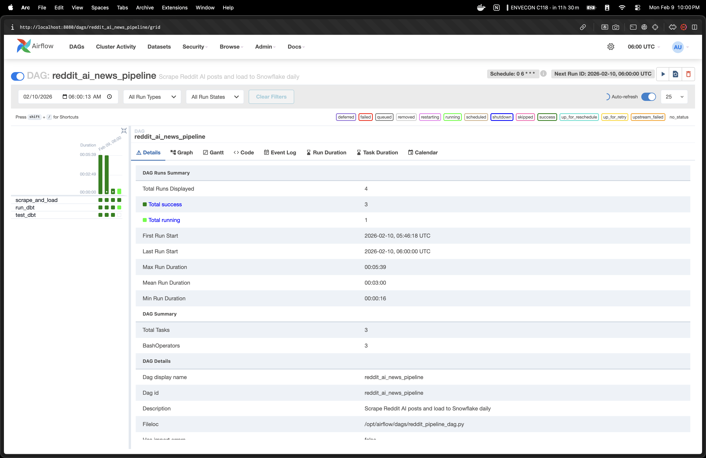
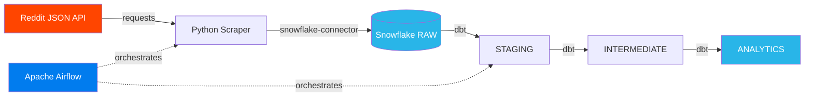
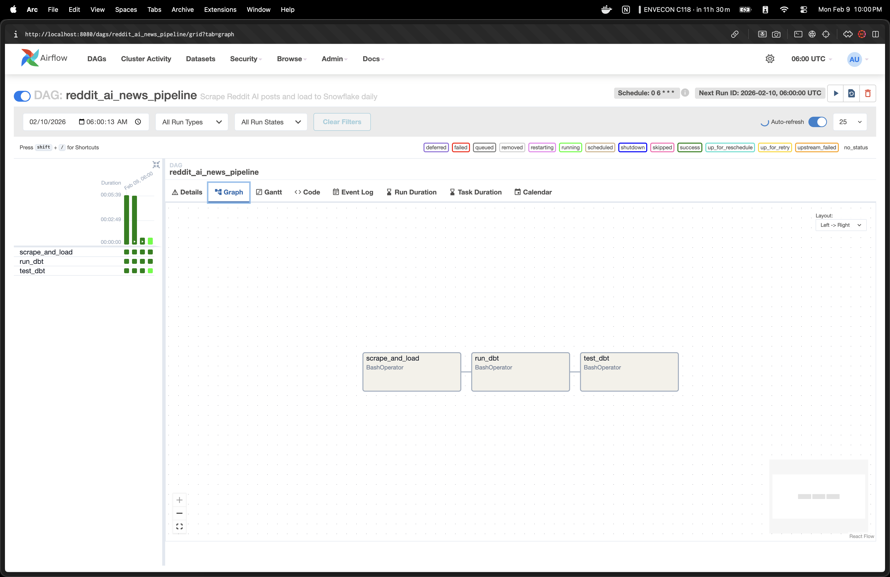
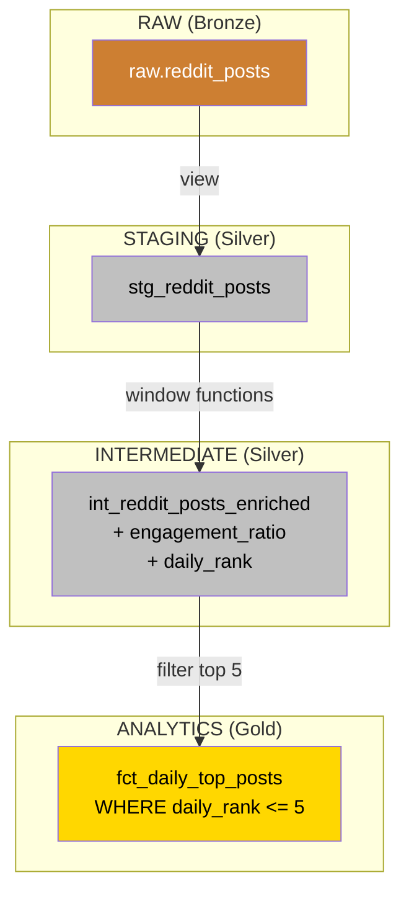
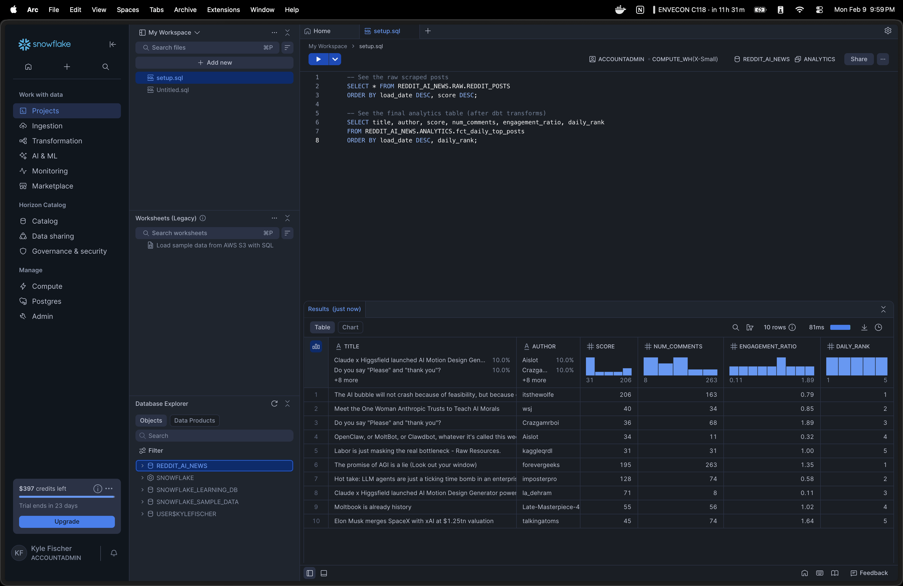

# Reddit AI News Pipeline


A production-ready data pipeline that scrapes top posts from r/ArtificialInteligence, loads them into Snowflake, and transforms them into analytics-ready tables using dbt -- all orchestrated by Apache Airflow and fully Dockerized for one-command deployment.



---

## Architecture



### Data Flow

| Stage | Tool | What Happens |
|-------|------|-------------|
| **Extract** | Python + Requests | Scrapes top 5 posts daily from Reddit's JSON API |
| **Load** | Python + Snowflake Connector | MERGE into raw table (idempotent, no duplicates) |
| **Transform** | dbt | Staging → Intermediate (enrichment) → Marts (analytics) |
| **Orchestrate** | Airflow | Schedules and monitors the pipeline via DAG |

### Pipeline Tasks

The Airflow DAG runs three tasks in sequence: scrape and load, dbt transforms, and dbt tests.



### dbt Lineage (Medallion Architecture)



---

## Tech Stack

- **Python 3.11** -- Scraping and data loading
- **Snowflake** -- Cloud data warehouse
- **dbt** -- SQL-based transformations with testing
- **Apache Airflow** -- Workflow orchestration and scheduling
- **Docker Compose** -- Containerized deployment (Airflow + Postgres)
- **GitHub Actions** -- CI pipeline (lint, test, dbt validate)

---

## Project Structure

```
ai_news_project/
├── Dockerfile                          # Container image (Airflow + deps)
├── docker-compose.yml                  # Multi-container orchestration
├── requirements.txt                    # Pinned Python dependencies
├── .env.example                        # Credential template
├── .github/
│   └── workflows/ci.yml               # CI: lint, test, dbt validate
│
├── scraper/                            # Extract & Load
│   ├── reddit_scraper.py               # Fetches posts from Reddit JSON API
│   ├── snowflake_loader.py             # MERGE loads into Snowflake
│   └── main.py                         # Pipeline entry point
│
├── dbt_project/                        # Transform
│   ├── dbt_project.yml
│   └── models/
│       ├── staging/stg_reddit_posts.sql
│       ├── intermediate/int_reddit_posts_enriched.sql
│       └── marts/fct_daily_top_posts.sql
│
├── airflow/dags/                       # Orchestrate
│   └── reddit_pipeline_dag.py
│
├── docker/
│   └── dbt_profiles.yml                # dbt config for Docker environment
│
├── snowflake/
│   └── setup.sql                       # Warehouse, database, and table DDL
│
└── tests/
    └── test_scraper.py                 # Unit tests with mocked HTTP
```

---

## Quick Start (Docker)

### Prerequisites

- [Docker Desktop](https://www.docker.com/products/docker-desktop/) installed
- A [Snowflake account](https://signup.snowflake.com/) (free trial works)

### 1. Clone and configure

```bash
git clone https://github.com/kylefischer/Automated-News-Data-Pipeline.git
cd Automated-News-Data-Pipeline/ai_news_project

cp .env.example .env
# Edit .env with your Snowflake credentials
```

### 2. Run the Snowflake setup

Open a SQL Worksheet in Snowflake and execute `snowflake/setup.sql` as ACCOUNTADMIN. This creates the warehouse, database, schemas, and tables.

### 3. Start the pipeline

```bash
docker compose up -d
```

This starts:
- **Airflow Webserver** on http://localhost:8080 (login: `admin` / `admin`)
- **Airflow Scheduler** to run the DAG on schedule
- **Postgres** as the Airflow metadata database

### 4. Trigger the pipeline

Open http://localhost:8080, find `reddit_ai_news_pipeline`, and click **Trigger DAG**. Watch the tasks turn green:

1. `scrape_and_load` -- Fetches Reddit posts and loads them into Snowflake
2. `run_dbt` -- Transforms data through staging, intermediate, and marts layers
3. `test_dbt` -- Validates data quality with dbt tests


### 5. Query the results

```sql
SELECT title, author, score, num_comments, engagement_ratio, daily_rank
FROM REDDIT_AI_NEWS.ANALYTICS.fct_daily_top_posts
WHERE load_date = CURRENT_DATE()
ORDER BY daily_rank;
```



### Stop the pipeline

```bash
docker compose down          # Stop containers
docker compose down -v       # Stop and remove all data (clean slate)
```

---

## Local Development (Without Docker)

```bash
cd ai_news_project
python3 -m venv .venv
.venv/bin/pip install -r requirements.txt

# Run the scraper
cd scraper && ../.venv/bin/python main.py

# Run dbt
cd ../dbt_project
export SNOWFLAKE_PASSWORD='your_password'
../.venv/bin/dbt run
../.venv/bin/dbt test
```

---

## Running Tests

```bash
# Python unit tests
pip install pytest
pytest tests/ -v

# dbt tests (requires Snowflake connection)
cd dbt_project
dbt test
```

---

## CI/CD

GitHub Actions runs on every push and PR to `main`:

| Job | What It Does |
|-----|-------------|
| **Lint** | Checks code style with `ruff` |
| **Test** | Runs Python unit tests with `pytest` |
| **dbt Compile** | Validates dbt SQL without a Snowflake connection |

---

## Cloud Deployment (GCP)

Deploy to Google Cloud Compute Engine for a live demo, then tear it down to avoid costs.

### Deploy

```bash
# Create a VM with Docker
gcloud compute instances create reddit-pipeline \
  --machine-type=e2-small \
  --image-family=ubuntu-2204-lts \
  --image-project=ubuntu-os-cloud \
  --zone=us-central1-a

# Open Airflow port
gcloud compute firewall-rules create allow-airflow \
  --allow=tcp:8080 --direction=INGRESS

# SSH into the VM
gcloud compute ssh reddit-pipeline --zone=us-central1-a

# On the VM: install Docker, clone repo, start pipeline
sudo apt-get update && sudo apt-get install -y docker.io docker-compose-v2
sudo usermod -aG docker $USER && newgrp docker
git clone https://github.com/kylefischer/Automated-News-Data-Pipeline.git
cd Automated-News-Data-Pipeline/ai_news_project
cp .env.example .env   # Edit with your credentials
docker compose up -d
```

Access Airflow at `http://EXTERNAL_IP:8080` (find IP in GCP Console).

### Tear Down

```bash
gcloud compute instances delete reddit-pipeline --zone=us-central1-a --quiet
gcloud compute firewall-rules delete allow-airflow --quiet
```

Total cost: a few cents for an hour of runtime.

---

## Key Design Decisions

- **Idempotent loads**: MERGE statements prevent duplicate rows when the pipeline re-runs
- **Medallion architecture**: Raw → Staging → Intermediate → Marts for clean data lineage
- **ELT pattern**: Load raw data first, transform in the warehouse (leverages Snowflake compute)
- **Containerized**: Docker Compose makes the project portable and reproducible
- **CI pipeline**: Automated linting, testing, and dbt validation on every commit

---

## Skills Demonstrated

- **Data Engineering** -- End-to-end ELT pipeline from extraction to analytics-ready tables
- **Snowflake** -- Warehouse provisioning, RBAC with three roles, MERGE upserts
- **dbt** -- Medallion architecture (staging/intermediate/marts), source testing, custom macros
- **Apache Airflow** -- DAG authoring, BashOperator task chaining, scheduled orchestration
- **Docker** -- Multi-service containerization with Compose (Airflow + Postgres)
- **CI/CD** -- GitHub Actions with linting, unit tests, and dbt validation
- **Python** -- REST API integration, Snowflake connector, unit testing with mocks

---

## Future Enhancements

- Add more subreddits (r/MachineLearning, r/ChatGPT)
- Sentiment analysis using an LLM API
- Streamlit dashboard for data visualization
- Slack alerts for viral posts (score > 500)
- dbt snapshots for tracking post score changes over time
